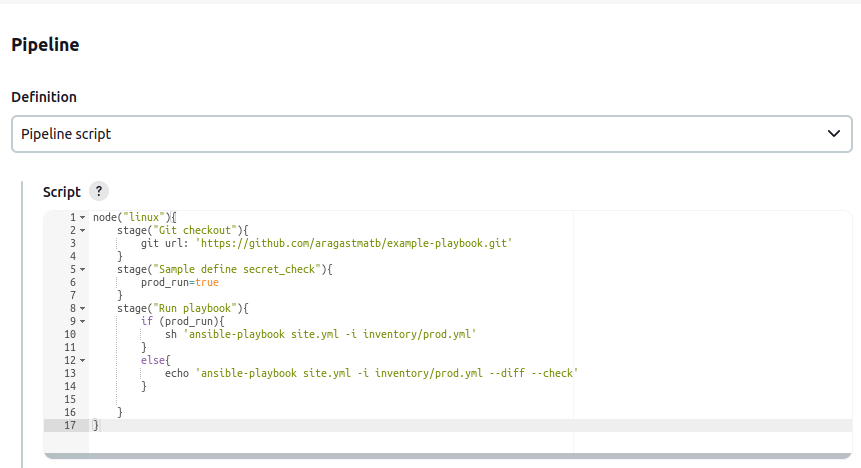

# Домашнее задание к занятию 10 «Jenkins»

## Подготовка к выполнению

1. Создать два VM: для jenkins-master и jenkins-agent.
2. Установить Jenkins при помощи playbook.
3. Запустить и проверить работоспособность.
4. Сделать первоначальную настройку.

## Решение 
Развертывание инфраструктуры , запись хостов и прогон playbook  делаем с помощью [Terraform](./terraform) . [Playbook](./infrastructure/site.yml) переделал под Ubuntu 22.04.

## Основная часть

1. Сделать Freestyle Job, который будет запускать `molecule test` из любого вашего репозитория с ролью.
2. Сделать Declarative Pipeline Job, который будет запускать `molecule test` из любого вашего репозитория с ролью.
3. Перенести Declarative Pipeline в репозиторий в файл `Jenkinsfile`.
4. Создать Multibranch Pipeline на запуск `Jenkinsfile` из репозитория.
5. Создать Scripted Pipeline, наполнить его скриптом из [pipeline](./pipeline).
6. Внести необходимые изменения, чтобы Pipeline запускал `ansible-playbook` без флагов `--check --diff`, если не установлен параметр при запуске джобы (prod_run = True). По умолчанию параметр имеет значение False и запускает прогон с флагами `--check --diff`.
7. Проверить работоспособность, исправить ошибки, исправленный Pipeline вложить в репозиторий в файл `ScriptedJenkinsfile`.
8. Отправить ссылку на репозиторий с ролью и Declarative Pipeline и Scripted Pipeline.
9. Сопроводите процесс настройки скриншотами для каждого пункта задания!!

## Решение
1. Freestyle Job

2.Declarative Pipeline Job

3.Репозиторий с файлом [`Jenkinsfile`](https://github.com/reocoker85/workfiles/blob/main/Jenkinsfile)

4.Multibranch Pipeline

5.Scripted Pipeline  [`ScriptedJenkinsfile`](https://github.com/reocoker85/workfiles/blob/main/ScriptedJenkinsfile)

