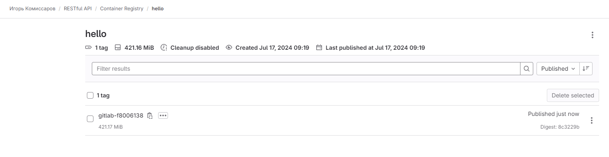
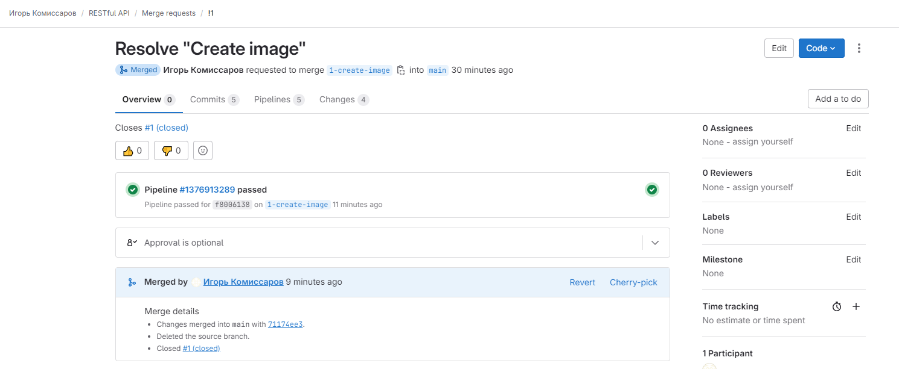
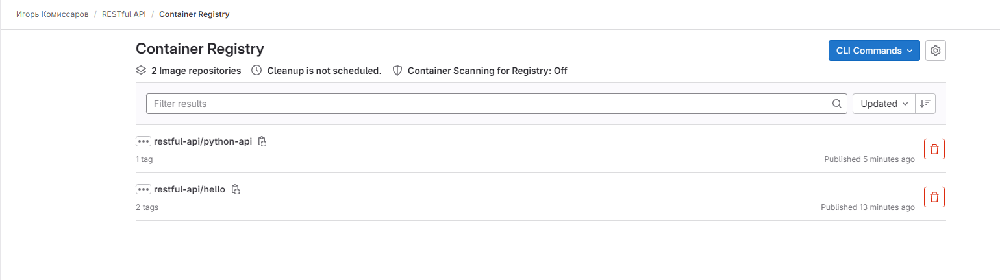

# Домашнее задание к занятию 12 «GitLab»

## Подготовка к выполнению


1. Или подготовьте к работе Managed GitLab от yandex cloud [по инструкции](https://cloud.yandex.ru/docs/managed-gitlab/operations/instance/instance-create) .
Или создайте виртуальную машину из публичного образа [по инструкции](https://cloud.yandex.ru/marketplace/products/yc/gitlab ) .
2. Создайте виртуальную машину и установите на нее gitlab runner, подключите к вашему серверу gitlab  [по инструкции](https://docs.gitlab.com/runner/install/linux-repository.html) .

3. (* Необязательное задание повышенной сложности. )  Если вы уже знакомы с k8s попробуйте выполнить задание, запустив gitlab server и gitlab runner в k8s  [по инструкции](https://cloud.yandex.ru/docs/tutorials/infrastructure-management/gitlab-containers). 

4. Создайте свой новый проект.
5. Создайте новый репозиторий в GitLab, наполните его [файлами](./repository).
6. Проект должен быть публичным, остальные настройки по желанию.

## Основная часть

### DevOps

В репозитории содержится код проекта на Python. Проект — RESTful API сервис. Ваша задача — автоматизировать сборку образа с выполнением python-скрипта:

1. Образ собирается на основе [centos:7](https://hub.docker.com/_/centos?tab=tags&page=1&ordering=last_updated).
2. Python версии не ниже 3.7.
3. Установлены зависимости: `flask` `flask-jsonpify` `flask-restful`.
4. Создана директория `/python_api`.
5. Скрипт из репозитория размещён в /python_api.
6. Точка вызова: запуск скрипта.
7. При комите в любую ветку должен собираться docker image с форматом имени hello:gitlab-$CI_COMMIT_SHORT_SHA . Образ должен быть выложен в Gitlab registry или yandex registry.   

### Решение

Dockerfile:
```dockerfile
FROM centos:7
COPY CentOS-Base.repo /etc/yum.repos.d/CentOS-Base.repo
WORKDIR /python_api
RUN yum -y update && yum install -y wget curl gcc make zlib-devel libffi-devel
RUN wget https://www.python.org/ftp/python/3.7.2/Python-3.7.2.tgz && tar xzf Python-3.7.2.tgz
RUN cd Python-3.7.2 && ./configure --enable-optimizations && make altinstall
RUN echo 'alias python3.7="python3"' >> ~/.bashrc
RUN yum -y install python3-pip
COPY requirements.txt requirements.txt
RUN pip3 install -r requirements.txt
COPY python-api.py python-api.py
CMD ["python3", "python-api.py"]
```
Pipeline:
```yaml
image: docker:git
services:
- docker:dind

stages:
- build
- test
- deploy

variables:
  CONTAINER_TEST_IMAGE: registry.gitlab.com/reocoker1985/restful-api/hello:gitlab-$CI_COMMIT_SHORT_SHA
  CONTAINER_RELEASE_IMAGE: registry.gitlab.com/reocoker1985/restful-api/python-api:latest

before_script:
  - docker login -u $CI_REGISTRY_USER -p $CI_REGISTRY_PASSWORD $CI_REGISTRY

build:
  stage: build
  tags:
    - linux
  script:
    - docker build -t $CONTAINER_TEST_IMAGE .
    - docker push $CONTAINER_TEST_IMAGE

deploy:
  stage: deploy
  tags:
    - linux
  script:
    - docker pull $CONTAINER_TEST_IMAGE
    - docker tag $CONTAINER_TEST_IMAGE $CONTAINER_RELEASE_IMAGE
    - docker push $CONTAINER_RELEASE_IMAGE
  only:
    - main
```




### Product Owner

Вашему проекту нужна бизнесовая доработка: нужно поменять JSON ответа на вызов метода GET `/rest/api/get_info`, необходимо создать Issue в котором указать:

1. Какой метод необходимо исправить.
2. Текст с `{ "message": "Already started" }` на `{ "message": "Running"}`.
3. Issue поставить label: feature.

### Developer

Пришёл новый Issue на доработку, вам нужно:

1. Создать отдельную ветку, связанную с этим Issue.
2. Внести изменения по тексту из задания.
3. Подготовить Merge Request, влить необходимые изменения в `master`, проверить, что сборка прошла успешно.


### Tester

Разработчики выполнили новый Issue, необходимо проверить валидность изменений:

1. Поднять докер-контейнер с образом `python-api:latest` и проверить возврат метода на корректность.
2. Закрыть Issue с комментарием об успешности прохождения, указав желаемый результат и фактически достигнутый.


